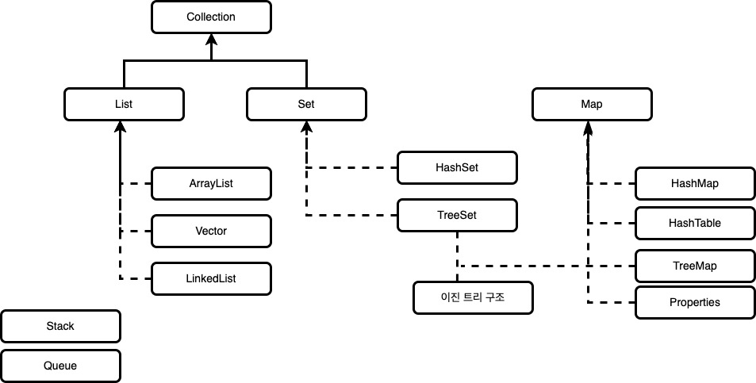
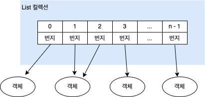
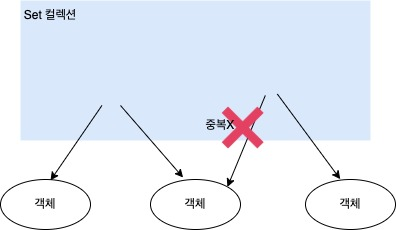
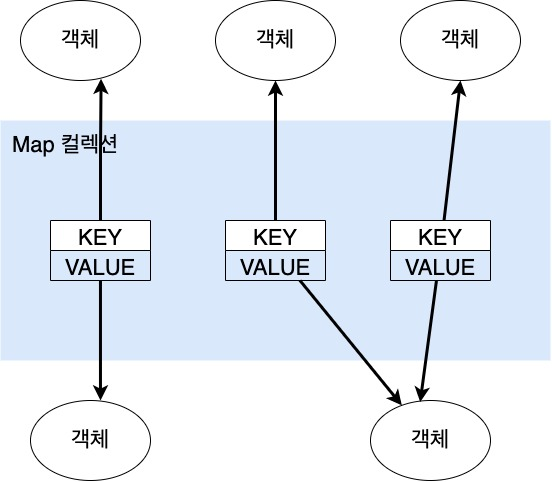

# 자바 컬렉션 프레임워크(List, Set, Map) 총정리

## 컬렉션 프레임워크란?

배열을 사용하다 보면 여러가지 비효율적인 문제가 생깁니다. 가장 큰 문제점은 크기가 고정적이라는 것입니다. 
배열의 크기는 생성할 때 결정되면 그 크기를 넘어가게 되면 더이상 데이터를 저장할 수 없습니다. 
또 데이터를 삭제하면 해당 인덱스의 데이터는 비어있어 메모리가 낭비되는 등 여러 문제점들이 발생합니다.
그렇기에 자바는 배열의 이러한 문제점을 해결하기 위해, 널리 알려져 있는 자료구조를 바탕으로 객체나 데이터들을 효율적으로 관리(추가, 삭제, 검색, 저장)할 수 있는 자료구조들을 만들어 놓았습니다.
이러한 자료구조들이 있는 라이브러리를 컬렉션 프레임워크라고 합니다. 대표적으로는 List, Set, Map, Stack, Queue등이 있습니다.

## List 컬렉션

컬렉션 프레임워크를 상속받고 있는 List 컬렉션은 객체를 일렬로 늘어놓는 구조를 가지고 있습니다. 
List 컬렉션은 객체를 인덱스로 관리하기 때문에 객체를 저장하면 자동 인덱스가 부여되고 인덱스로 객체를 검색, 삭제할 수 있는 기능을 제공합니다.(인덱스에는 데이터가 저장되어 있는 참조 값을 가지고 있습니다.)

List컬렉션은 객체 자체를 저장하는 것이 아니라 위와 같이 객체의 번지를 참조합니다.
동일한 객체를 종복 젖아할 수 있는데 이 경우 동일한 번지가 참조됩니다.
null도 저장이 가능한데 이 경우 해당 인덱스는 객체를 참조하지 않습니다.
List컬렉션을 구현하는 대표적인 클래스들은 ArrayList, LinkedList, Vertor가 있으며 이 3가지 클래스는 List 인터페이스를 같이 상속하고 있으므로 공통적으로 사용할 수 있는 메서드들이 많습니다.
기본적인 List의 메서드는 아래와 같습니다.

### List 클래스 주요 메서드

| 메서드                            | 설명                             |
|--------------------------------|--------------------------------|
| boolean add(E element)         | 주어진 객체를 맨 끝에 추가합니다.            |
| void add(int index, E element) | 주어진 인덱스에 객체를 추가합니다.            |
| set(int index, E element)      | 주어진 인덱스에 저장된 객체를 주어진 객체로 바꿉니다. |
| boolean contains(Object o)     | 주어진 객체가 있는지에 대한 여부를 검색합니다.     |
| E get(int index)               | 주어진 인덱스에 저장된 객체를 리턴합니다.        |
| isEmpty()                      | 컬렉션이 비어있는지 여부를 확인합니다.          |
| int size()                     | 저장되어 있는 전체 객체 수를 리턴합니다.        |
| E remove(int index)            | 주어진 인덱스에 저장된 객체를 삭제합니다.        |
| void clear()                   | 주어진 인덱스에 저장된 객체를 삭제합니다.        |
| boolean remove(Object o)       | 주어진 객체를 삭제합니다.                 |

### List 클래스의 자료구조들 사용법

- [[Java] 자바 ArrayList 사용법 & 예제 총정리](https://coding-factory.tistory.com/551)
- [[Java] 자바 LinkedList 사용법 & 예제 총정리](https://coding-factory.tistory.com/552)
- [[Java] 자바 Vector 사용법 & 예제 총정리](https://coding-factory.tistory.com/553)

참고: 코딩팩토리(https://coding-factory.tistory.com/550)

## Set컬렉션

앞서 살펴본 List 컬렉션은 선형구조를 가지고 있으므로 추가한 순서대로 저장이 되어 순서를 유지하였지만 Set컬렉션의 경우에는 저장 순서가 유지되지 않습니다. 
그렇기에 Set컬렉션은 순서 자체가 없으므로 인덱스로 객체를 검색해서 가져오는 get(index) 메서드도 존재하지 않습니다. 
대신 전체 객체를 대상으로 한 번씩 반복해서 가져오는 반복자(Iterator)를 제공합니다. 
반복자(Iterator)는 iterator() 메서드를 호출하면 얻을 수 있습니다.

또한 Set은 객체를 중복해서 저장할 수 없고 하나의 중복 저장이 안 되기에 null값도 하나만 저장할 수 있습니다. 
Set컬렉션은 수학의 집합에 비유될 수 있습니다. 집합은 순서와 상관없고 중복이 허용되지 않기 때문입니다. 
Set 컬렉션을 구현하는 대표적인 클래스들은 HashSet과 TreeSet이 있습니다. 
이 2가지 클래스는 Set 인터페이스를 같이 상속하고 있으므로 공통적으로 사용할 수 있는 메서드들이 존재합니다. 
기본적인 Set의 메서드는 아래와 같습니다.

### Set 클래스 주요 메서드

| 메서드                        | 설명                                            |
|----------------------------|-----------------------------------------------|
| boolean add(E e)           | 주어진 객체를 저장 후 성공적이면 true를 중복 객체면 false를 리턴합니다. |
| boolean contains(Object o) | 주어진 객체가 저장되어있는지 여부를 리턴합니다.                    |
| Iterator<E> iterator()     | 저장된 객체를 한번씩 가져오는 반복자를 리턴합니다.                  |
| isEmpty()                  | 컬렉션이 비어있는지 조사합니다.                             |
| int Size()                 | 저장되어 있는 전체 객체수를 리턴합니다.                        |
| isEmpty()                  | 컬렉션이 비어있는지 여부를 확인합니다.                         |
| int size()                 | 저장되어 있는 전체 객체 수를 리턴합니다.                       |
| void clear()               | 저장된 모든 객체를 삭제합니다.                             |
| boolean remove(Object o)   | 주어진 객체를 삭제합니다.                                |

### Set 클래스의 자료구조들 사용법

- [[Java] 자바 HashSet 사용법 & 예제 총정리](https://coding-factory.tistory.com/554)
- [[Java] 자바 TreeSet 사용법 & 예제 총정리](https://coding-factory.tistory.com/555)

## Map 컬렉션

Map 컬렉션은 키(key)와 값(value)으로 구성된 객체를 저장하는 구조를 가지고 있는 자료구조입니다. 
키는 중복으로 저장할 수 없고 값은 중복으로 저장할 수 있으며 중복된 key값이 들어온다면 기존의 값은 없어지고 새로운 값으로 대치됩니다.

Map은 Key와 Value라는 것을 한 쌍으로 갖는 자료형입니다. 
Map은 사물함을 연상할 수 있습니다. 사물함도 사물함 번호가 있고 사물함 내부에 물건들이 있습니다. 
사물함의 번호가 key가 되는 것이고 내부의 물건이 value가 되는 것입니다. 
자바의 맵(Map)은 이러한 대응관계를 쉽게 표현할 수 있게 해 주는 자료형입니다. 
Map은 리스트나 배열처럼 순차적으로(sequential) 해당 요소 값을 구하지 않고 key를 통해 value를 얻습니다.
맵(Map)의 가장 큰 특징이라면 key로 value를 얻어낸다는 점입니다. 따라서 Map 컬렉션은 키(key)로 데이터를 관리합니다.
Map 컬렉션을 구현하는 대표적인 클래스들은 HashMap, Hashtable, LinkedHashMap, TreeMap 등이 있습니다.  
이 클래스들은 Map 인터페이스를 같이 상속하고 있으므로 공통적으로 사용할 수 있는 메서드들이 존재합니다. 
기본적인 Map의 메서드는 아래와 같습니다.

### Map 클래스 주요 메서드

| 메서드                                 | 설명                                     |
|-------------------------------------|----------------------------------------|
| V put(K Key, V value)               | 주어진 키와 값을 추가하여 저장되면 값을 리턴합니다.          |
| boolean containsKey(Object Key)     | 주어진 키가 있는지 확인합니다.                      |
| boolean containsValue(Object value) | 주어진 값이 있는지 확인합니다.                      |
| Set<Map.Entry<K,V>> entrySet()      | 모든 Map.Entry 객체를 Set에 담아 리턴합니다.        |
| Set<K> keySet()                     | 모든 키를 Set객체에 담아서 리턴합니다.                |
| V get(Object key)                   | 주어진 키에 있는 값을 리턴합니다.                    |
| boolean isEmpty()                   | 컬렉션이 비어있는지 조사합니다.                      |
| int Size()                          | 저장되어 있는 전체 객체의 수를 리턴합니다.               |
| Collection<V> values()              | 저장된 모든 값을 Collection에 담아서 리턴합니다.       |
| void clear()                        | 저장된 모든 Map.Entry를 삭제합니다.               |
| V remove(Object Key)                | 주어진 키와 일치하는 Map.Entry를 삭제하고 값을 리턴합니다.  |

### Map 클래스의 자료구조들 사용법

- [[Java] 자바 HashMap 사용법 & 예제 총정리](https://coding-factory.tistory.com/556)
- [[Java] 자바 TreeMap 사용법 & 예제 총정리](https://coding-factory.tistory.com/557)

참조 : [코딩팩토리]https://coding-factory.tistory.com/550
