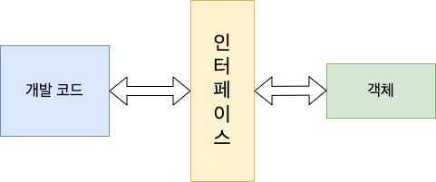
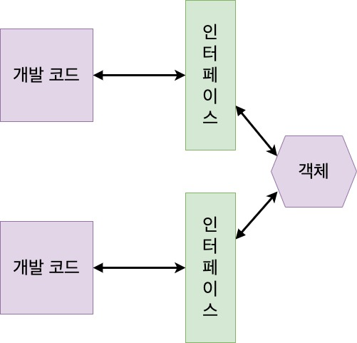
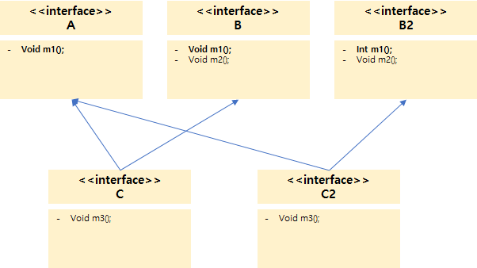
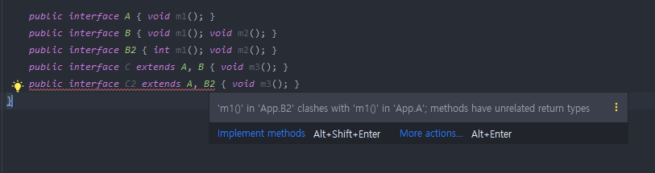
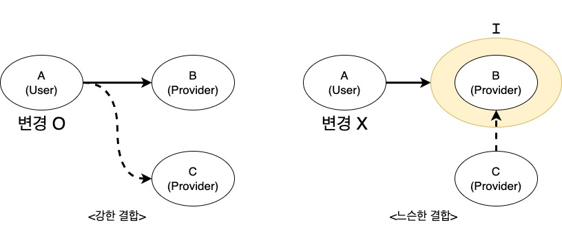
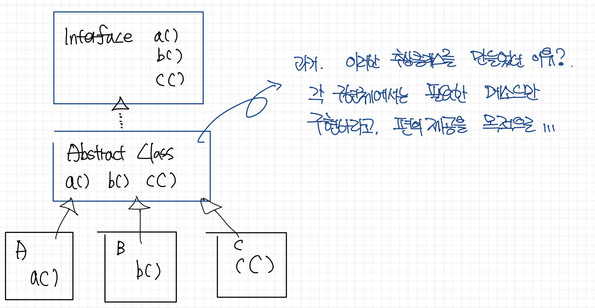
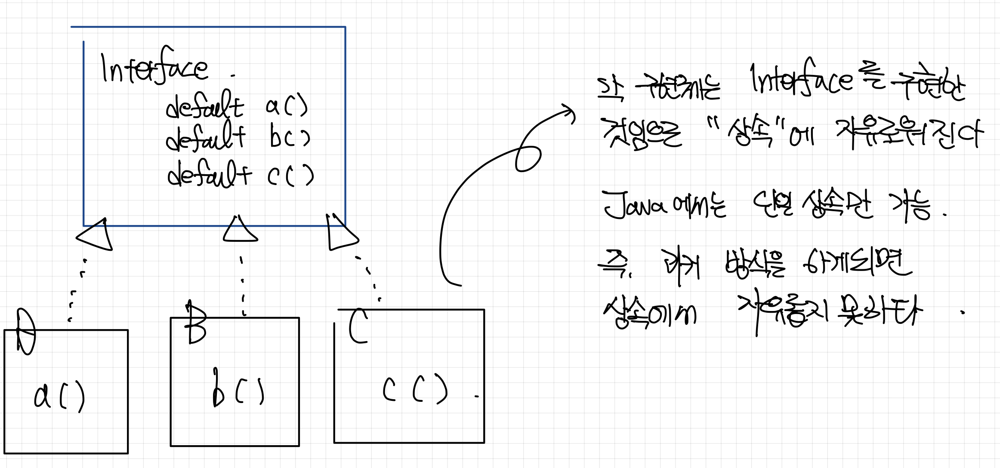

# 8주차 과제 : 인터페이스

# **목표**

자바의 인터페이스에 대해 학습하세요.

# **학습할 것 (필수)**

- 인터페이스 정의하는 방법
- 인터페이스 구현하는 방법
- 인터페이스 레퍼런스를 통해 구현체를 사용하는 방법
- 인터페이스 상속
- 인터페이스의 기본 메소드 (Default Method), 자바 8
- 인터페이스의 static 메소드, 자바 8
- (optional) 인터페이스의 private 메소드, 자바 9

---

## 인터페이스 정의하는 방법

인터페이스란 객체와 객체 사이에서 일어나는 상호 작용의 매개로 쓰인다.

- 서로 이어주는 다리 역할과 프로젝트의 설계도로 생각할 수 있다.

모든 기능을 추상화로 정의한 상태로 선언만 한다.

인터페이스의 선언은 예약어로 class 대신 "**interface**" 키워드를 사용하며,

접근 제어자로는 **public** 또는 **default**를 사용한다.

```java
interface InterfaceName{

}
```

또한, **implements** 키워드를 통해 일반 클래스에서 **인터페이스를 구현할** 수 있다.

**Java 8 이전까지**는 상수와 추상 메서드만 선언가능하였지만,

→ 추상 메소드만 가능했다는 것을 통해 강제성이 강했음을 유추할 수 있다.

**Java 8 이후부터는** default method와 static method가 추가되었다.

→ 두가지 메소드를 통해 구현 강제성 안에 유연함을 추구할 수 있게 되었다고 이해할 수 있다.

```java
public interface 인터페이스 명{
	// 상수
	타입 상수명 = 값;
	
	// 추상 메소드
	타입 메소드명(매개변수, ...);

	// 디폴트 메소드
	default 타입 메소드명(매개변수, ...){
		// 구현부
	}

	// 정적 메소드
	static 타입 메소드명(매개변수, ...){
		// 구현부
	}
}
```

1. 상수 **(절대적)**

   인터페이스에서 값을 정해줄태니 함부로 바꾸지 말고 제공해주는 값만 참조하라.

2. 추상 메소드 **(강제적)**

   가이드만 줄테니 오버라이딩해서 재구현하여 사용하라.

3. 디폴트 메소드 **(선택적)**

   인터페이스에서 기본적으로 제공해주지만, 구현내용이 원하지 않는다면 오버라이딩해서 재구현하여 사용하라

4. 스태틱 메소드 **(절대적)**

   인터페이스에서 제공해주는 것으로 무조건 사용


---

인터페이스는 추상 클래스와 같이 추상 메소드를 가지므로 추상 클래스와 매우 흡사하다.

인터페이스는 추상 클래스와 같이 인스턴스를 생성할 수 없고, 상속받은 클래스에서 구현한 뒤 자식 클래스를 인스턴스화 하여 사용한다.

## ### 추상클래스와 인터페이스의 공통점

- 다형성을 보장하기위해서 등장
- 객체를 생성 할 수 없다.(new X)
- 하위클래스에 의해 구현되어야 한다. (Override: 재정의 필수)
- 부모(상위 클래스)의 역할로 사용한다. (Upcasting으로 객체를 생성)
- 추상 메서드를 가진다.

### 추상클래스와 인터페이스의 차이점

1. 추상 클래스는 일반 메서드와 추상 메서드 둘다 가질 수 있다.

   → 인터페이스는 오로지 추상 메서드와 상수만을 가진다. (구현 로직을 작성할 수 없다.)

   **but**. java8 부터는 **default method**와 **static method**를 작성할 수 있다.

2. 인터페이스 내에 존재하는 **메서드**는 무조건 **"public abstract"** 로 선언되며, 이를 생략할 수 있다.
3. 인터페이스 내에 존재하는 **변수**는 무조건 **"public static final"** 로 선언되며, 이를 생략할 수 있다.

```java
// interface 의 제약 조건을 따르지 않았기 때문에 오류가 발생합니다.
private int a = 1;       

// 컴파일러가 자동적으로 public static final b = 2로 추가해줍니다.
public int b = 2;        

// 컴파일러가 자동적으로 public static final c = 3으로 추가해줍니다.
static int c = 3;         

// 컴파일러가 자동적으로 public static final d = 4로 추가해줍니다.
int d = 4;                
```

---

### 추상클래스와 인터페이스의 의미를 명확히 알고 접근하자.

(기본적인 것 부터...)

### 추상클래스는 "is-a : ~는 ~이다" 의 개념이다.

### 인터페이스는 "has-a : ~는 ~를 할 수 있다." 의 개념이다.

ex. SSON은 사람 Person 이면서 코딩(Developable)을 할 수 있다.

- class SSON **extends** Person **implements** Developable

---

### 인터페이스 사용의 이유

1. 개발 기간을 단축 시킬 수 있다.

   이러한 특징을 가진 인터페이스를 사용하면 다른 개발자들이 각각의 부분을 완성할 때까지 기다리지 않고 서로 규약만 정해두어 각자의 부분만 따로 나눠서 작성된 코드를 컴파일 할 수 있다.

2. 클래스간 결합도를 낮출 수 있다.

   코드의 종속성을 줄이고 유지보수성을 높이도록 해준다.

3. 표준화가 가능하다.

   클래스의 기본틀을 제공하여 개발자들에게 정형화된 개발을 강요할 수 있다.

   **→ 자바의 다형성을 극대화 하여 코드의 수정을 줄이고 유지보수성을 높인다.**


---

---

## 인터페이스 구현하는 방법



개발 코드가 인터페이스 메소드를 호출하면 인터페이스는 객체의 메소드를 호출한다.

객체는 인터페이스에서 정의된 추상 메소드와 동일한 메소드 이름, 매개 타입, 리턴타입을 가진 메소드를 가지고 있어야 한다.

이러한 객체를 **인터페이스의 구현(implements) 객채**라고 하며, 구현 객체를 생성하는 클래스를 **구현 클래스**라 한다.

### **구현 클래스**

보통의 클래스와 동일한데, 인터페이스 타입으로 사용할 수 있음을 알려주기 위해 클래스 선언부에 **implements** 키워드를 추가하고 인터페이스명을 명시해야 한다.

```java
public class 구현 클래스 명 implements 인터페이스 명 {
	// 인터페이스에 선언된 추상 메소드의 실체 메소드 선언
}
```

그리고 인터페이스에 선언된 추상 메소드의 실체 메소드를 선언해야 한다.

[RemoteControl.java](http://remotecontrol.java) (인터페이스)

```java

public interface RemoteControl {
    int MAX_VOLUME = 100;
    int MIN_VOLUMNE = 0;

    void turnOn();
    void turnOff();
    void setVolume(int volume);

    default void setMute(boolean mute){

    }
}
```

[Tv.java](http://tv.java) (RemoteControl.java 인터페이스를 구현한 구현 클래스)

```java
package me.ssonsh.java8to11.interfacetest;

public class Tv implements RemoteControl{

    private int volume;

    @Override
    public void turnOn() {
        System.out.println("Tv를 켭니다.");
    }

    @Override
    public void turnOff() {
        System.out.println("Tv를 끕니다.");
    }

    @Override
    public void setVolume(int volume) {
        if(volume > RemoteControl.MAX_VOLUME){
            this.volume = RemoteControl.MAX_VOLUME;
        }else if(volume < RemoteControl.MIN_VOLUMNE){
            this.volume = RemoteControl.MIN_VOLUMNE;
        }else{
            this.volume = volume;
        }
    }
}
```

[Audio.java](http://audio.java) (RemoteControl.java 인터페이스를 구현한 구현 클래스)

```java

public class Audio implements RemoteControl{

    private int volume;

    @Override
    public void turnOn() {
        System.out.println("Audio 켭니다.");
    }

    @Override
    public void turnOff() {
        System.out.println("Audio 끕니다.");
    }

    @Override
    public void setVolume(int volume) {
        if(volume > RemoteControl.MAX_VOLUME){
            this.volume = RemoteControl.MAX_VOLUME;
        }else if(volume < RemoteControl.MIN_VOLUMNE){
            this.volume = RemoteControl.MIN_VOLUMNE;
        }else{
            this.volume = volume;
        }
    }

    @Override
    public void setMute(boolean mute){
        if(mute){
            System.out.println("Audio 를 무음으로 변경합니다.");
        }else{
            System.out.println("Audio 를 무음을 해제합니다.");
        }
    }
}
```

### **익명 구현 객체**

구현 클래스를 만들어 사용하는 것이 일반적이고, 클래스를 재사용할 수 있기 떄문에 편리하지만, **일회성의 구현 객체를 만들기 위해** 소스파일을 만들고 클래스를 선언하는 것은 비효율적이다.

자바는 소스 파일을 만들지 않고도 구현 객체를 만들 수 있는 방법을 제공하며 이것이 **"익명 구현 객체"** 이다.

```java
인터페이스 변수 = new 인터페이스(){
	// 인터페이스에 선언된 추상 메소드의 실체 메소드 선언
}
```

- 인터페이스에 선언된 추상메소드를 실체 메소드로 선언해야 하며, 그렇지 않으면 오류가 발생한다.

Use [RemoteControl.java](http://remotecontrol.java) 인터페이스

```java

public class App {
    public static void main(String[] args){

        RemoteControl remoteControl = new RemoteControl() {
            @Override
            public void turnOn() {

            }

            @Override
            public void turnOff() {

            }

            @Override
            public void setVolume(int volume) {

            }
        };

    }
}
```

### **plus.**

### 다중 인터페이스 구현 클래스



객체는 다수의 인터페이스 타입으로 사용할 수 있다.

인터페이스 A와 인터페이스 B가 객체의 메소드를 호출할 수 있으려면, 객체는 이 두 인터페이스를 모두 구현해야 한다.

```java
public class 구현 클래스 implements 인터페이스A, 인터페이스 B{
	// 인터페이스 A의 추상 메소드 실체 메소드 선언
	// 인터페이스 B의 추상 메소드 실체 메소드 선언
} 
```

다중 인터페이스를 구현할 경우

구현 클래스는 모든 인터페이스의 추상 메소드에 대해 실체 메소드를 작성해야 한다.

[RemoteControl.java](http://remotecontrol.java) 인터페이스와 [Searchable.java](http://searchable.java) 인터페이스

```java

public interface RemoteControl {
    int MAX_VOLUME = 100;
    int MIN_VOLUMNE = 0;

    void turnOn();
    void turnOff();
    void setVolume(int volume);

    default void setMute(boolean mute){

    }
}

////

package me.ssonsh.java8to11.interfacetest;

public interface Searchable {
    void search(String url);
}
```

[SmartTv.java](http://smarttv.java) (RemoteControl 과 Searchable 인터페이스를 구현)

```java

public class SmartTv implements RemoteControl, Searchable{

    private int volume;

    @Override
    public void turnOn() {
        System.out.println("Smart Tv를 켭니다.");
    }

    @Override
    public void turnOff() {
        System.out.println("Smart Tv를 끕니다.");
    }

    @Override
    public void setVolume(int volume) {
        if(volume > RemoteControl.MAX_VOLUME){
            this.volume = RemoteControl.MAX_VOLUME;
        }else if(volume < RemoteControl.MIN_VOLUMNE){
            this.volume = RemoteControl.MIN_VOLUMNE;
        }else{
            this.volume = volume;
        }
    }

    @Override
    public void search(String url) {
        System.out.println(url + " 의 결과를 검색합니다.");
    }
}
```

(참조. [https://blog.naver.com/mals93/220716635488](https://blog.naver.com/mals93/220716635488))

---

## 인터페이스 상속과

## 인터페이스 레퍼런스를 통해 구현체를 사용하는 방법

### 인터페이스의 상속

인터페이스의 상속 구조에서는

**→ 서브 인터페이스는 수퍼 인터페이스의 메서드까지 모두 구현해야 한다.**

→ **인터페이스 레퍼런스는** 인터페이스를 **구현한 클래스의 인스턴스를 가리킬 수 있고**,

해당 인터페이스에 선언된 메서드(수퍼 인스턴스 메소드 포함)만 호출 할 수 있다.

### 인터페이스 다중 상속

인터페이스는 클래스와 달리 다중 상속이 가능하다.

인터페이스의 메서드는 추상 메서드로 구현하기 전의 메서드이기 떄문에 어떤 인터페이스의 메서드를 상속받아도 같기 떄문이다.

**but.**

상위 인터페이스에 있는 메서드 중에서 **메서드 명과 파라미터 형식은 같지만 리턴 타입이 다른** 메서드가 있다면, 둘중 어떤 것을 상속받느냐에 따라 **규칙이 달라지기 때문에 다중 상속이 불가능**하다.



- 위와 같은 구조에서 A와 B2를 확장하는 인터페이스 C2를 만드려고 할때 IDE에서는 아래와 같이 컴파일이 될 수 없는 에러를 노출한다.



  **unrelated Return Types..**


---

### **Q. 두개 인터페이스를 구현하는 경우 메소드 시그니쳐가 같은 케이스에서는 어떻게 해야할까?**

중복되는 인터페이스의 추상 메소드를 재정의 하여 사용할 수 있다.

[JoinMember.java](http://joinmember.java) 인터페이스

```java

public interface JoinMember {

    default void preJoin(){
        System.out.println("pre member");
    }
}
```

[JoinGroup.java](http://joingroup.java) 인터페이스

```java

public interface JoinGroup {

    default void preJoin(){
        System.out.println("pre group");
    }
}
```

JoinMember와 JoinGroup 을 구현한 [Member.java](http://member.java) 클래스

```java

public class Member implements JoinMember, JoinGroup{

    @Override
    public void preJoin() {
        JoinMember.super.preJoin();
        JoinGroup.super.preJoin();
    }
}
```

→ preJoin 메소드를 재정의 하지 않으면 컴파일 에러가 발생한다.

→ 스태택 메소드가 아님으로 참조할 수 있는 방법이 위와 같다
**".super.메소드"**

### **plus.**

그렇다면 static 메소드는? ⇒ **static 메소드는 override가 안된다.**

```java

public interface StaticJoinMember {

    static void preJoin(){
        System.out.println("static pre join member");
    }
}
```

```java

public interface JoinMember extends StaticJoinMember{
    
    default void preJoin(){
        System.out.println("pre member");
    }

    default void afterJoin(){
        System.out.println("after member");
    }
}
```

- 여기서 preJoin()은 Override이 아니다.
- 전혀다른 영역에 위치하고 있는 것이다.

즉, StaticJoinMember의 preJoin은 아래와 같이 사용하는 것 밖에 없다.

```java
StaticJoinMember.preJoin();
```

---

### 예제코드로 인터페이스 상속과 인터페이스 레퍼런스에 대해 알아보자.

[**Bar.java](http://bar.java) 인터페이스는 [Foo.java](http://foo.java) 인터페이스를 상속한 인터페이스로 정의한다.**

```java

public interface Bar extends Foo {
    void barMethod();
}

////
package me.ssonsh.study.interfacestudy;

public interface Foo {

    void fooMethod();
}
```

[**Bar.java](http://bar.java) 인터페이스의 구현체로 DefaultFoo.java를 구현한다.**

- barMethod() 는 Bar 인터페이스 의 추상 메소드를 구현
- fooMethod() 는 Bar 인터페이스가 상속하고 있는 Foo 인터페이스의 추상 메소드를 구현
- testMethod_1, testMethod_2 는 DefaultFoo 구현체 자체의 메소드

```java

public class DefaultFoo implements Bar {
    @Override
    public void barMethod() {
        System.out.println("bar method - by DefaultFoo");
    }

    @Override
    public void fooMethod() {
        System.out.println("foo method - by DefaultFoo");
    }

    public void testMethod_1(){
        System.out.println("test method _ 1");
    }
    public void testMethod_2(){
        System.out.println("test method _ 2");
    }
}
```

**Use DefaultFoo.java**

- 클래스 타입 래퍼런스와
- 인스턴스 레퍼런스 두가지를 활용해본다.

```java
import me.minzino.study.interfacestudy.Bar;
import me.minzino.study.interfacestudy.DefaultFoo;

public class App {
    public static void main(String[] args){
        System.out.println("hi");

        DefaultFoo defaultFoo = new DefaultFoo();
        defaultFoo.fooMethod();
        defaultFoo.barMethod();
        defaultFoo.testMethod_1();
        defaultFoo.testMethod_2();

        Bar bar = defaultFoo;
        bar.barMethod();
        bar.fooMethod();
    }
}
```

- **클래스 타입 레퍼런스는** 해당 클래스에 정의된 메서드를 호출 할 수 있다.

    ```java
    
    DefaultFoo defaultFoo = new DefaultFoo();
    defaultFoo.fooMethod();
    defaultFoo.barMethod();
    defaultFoo.testMethod_1();
    defaultFoo.testMethod_2();
    ```


- **인스턴스 레퍼런스**는 해당 인터페이스를 구현한 클래스 인스턴스를 가리킬 수 있고
  해당 인터페이스에 선언된 메서드만 호출 할 수 있다.

    ```java
    Bar bar = defaultFoo;
    bar.barMethod();
    bar.fooMethod();
    ```


### 다중 인터페이스에서의 인터페이스 레퍼런스

위에서 언급하였듯이 다중 인터페이스를 통해 클래스는 여러개의 규칙을 이행할 수 있다.

**한 클래스가 여러 개의 인터페이스를 구현했다면,**

**각 인터페이스로 구분해서 그 객체를 사용할 수 있게 된다.**

**즉, 구현체를 어떤 인터페이스 레퍼런스에 담느냐에 따라 사용할 때 따르는 규칙이 달라진다.**

[Bar.java](http://bar.java) 인터페이스와 [Baz.java](http://baz.java) 인터페이스를 다중으로 구현한 클래스

```java
package me.minzino.study.interfacestudy;

public class DefaultFoo implements Bar, Baz {
    @Override
    public void barMethod() {
        System.out.println("bar method - by DefaultFoo");
    }

    @Override
    public void fooMethod() {
        System.out.println("foo method - by DefaultFoo");
    }

    @Override
    public void bazMethod() {
        System.out.println("baz method  By DefaultFoo");
    }
}
```

Use DefaultFoo.java

```java
import me.minzino.study.interfacestudy.Bar;
import me.minzino.study.interfacestudy.Baz;
import me.minzino.study.interfacestudy.DefaultFoo;

public class App {
    public static void main(String[] args){
        System.out.println("hi");

        DefaultFoo defaultFoo = new DefaultFoo();
        defaultFoo.fooMethod();
        defaultFoo.barMethod();

        Bar bar = defaultFoo;
        bar.barMethod();
        bar.fooMethod();

        Baz baz = defaultFoo;
        baz.bazMethod();
    }
}
```

- DefaultFoo 는 Bar 인터페이스와 Baz 인터페이스를 구현하였음으로 위 예제를 보듯이
- **Bar 라는 인터페이스 레퍼런스에 담을수도 있고**
- **Baz 라는 인터페이스 레퍼런스에 담을수도 있다.**

---

## **? 강한 결합과 느슨한 결합**

강한 결합과 느슨한 결합에 대한 이해가 선행되어야 인터페이스를 사용하는 이유를 이해할 수 있을 것이다.



**왼쪽의 그림(강한 결합)부터 살펴보자.**

- A는 B에 의존하고 있다. (A가 B를 사용)
- 이 때, A가 C를 사용하게 하려면??

→ A는 B를 의존하고 있는 코드를 C를 의존하게끔 변경해야 한다. **(강한 결합.)**

**오른쪽 그림(느슨한 결합)을 살펴보자.**

- A는 I 인터페이스에 의존하고 있고, I 인터페이스는를 구현한 B를 사용한다.
- 이 때, A가 C를 사용하게 하려면?

→ A는 I에 의존하고 있기 때문에, I 인터페이스를 구현한 C를 사용한다면, 따로 코드를 변경하지 않아도 된다. **(느슨한 결합.)**

**강한 결합** : 빠르지만 변경에 분리

**느슨한 결합 :** 느리자만 유연하고 변경에 유리

**[강한 결합] 직접적인 관계의 두 클래스 (A → B)**

```java
class A {
    public void methodA(B b) { // B를 사용!!(따라서 B와 관계 있음)
        b.methodB();
    }
}

class B {
    public void methodB() {
        System.out.println("methodB()");
    }
}

class InterfaceTest {
    public static void main(String args[]) {
        A a = new A();
        a.methodA(new B());
    }
}
```

**[느슨한 결합] 간접적인 관계의 두 클래스 (A → I → B)**

```java
class A {
    public void methodA(I i) {// I를 사용! (따라서 A는 B클래스와 관계 없음.I 인터페이스랑만 관계 있음)
        i.methodB();
    }
}

// 껍데기
interface I {
    public abstract void methodB();
}

// 알맹이
class B implements I {
    public void methodB() {
        System.out.println("methodB()");
    }
}

// 나중에 B를 C로 변경하여도 C만 변경하면 됨. methodB를 호출하는 A를 변경할 필요 없음
class c implements I {
    public void methodB() {
        System.out.println("methodB() in C");
    }
}
```

---

## 인터페이스의 기본 메소드 (default Method)

(참고. 더 자바, Java8 강의)

**인터페이스에서의 기본 메소드란?**

- 인터페이스에 메소드 선언이 아니라 **"구현체"**를 제공하는 방법
- 해당 인터페이스를 구현한 클래스의 어떠한 영향없이 새로운 기능을 추가하는 방법
- default method 는 해당 인터페이스를 구현한 **구현체가 모르게 추가된 기능임으로 그만큼 리스크가 따른다.**

  → 컴파일 에러는 발생하지 않지만, 특정한 구현체의 로직에 따라 런타임 에러가 발생할 수 있다.

  → 사용하게 된다면, 구현체가 잘못사용하지 않도록 반드시 문서화 하자!

- Object가 제공하는 기능(equals, hashCode)와 같은 기본 메소드는 제공할 수 없다.

  → 구현체가 재정의 하여 사용하는 것은 상관없다.

- 본인이 수정할 수 있는 인터페이스에만 기본 메소드를 제공할 수 있다.
- 인터페이스를 상속받은 인터페이스에서 다시 추상 메소드로 변경할 수 있다.
- 인터페이스 구현체가 default method를 재정의 할 수 있다.

---

### Why?

기존 Collection에 새로운 기능들이 추가되려고 할 때,

- forEach, of, ... 등등,

→ 인터페이스에 기능을 추가했음애도, 이 인터페이스를 상속한 클래스들이 깨지지 않게,

<aside>
💡 ..(중략).. 바로 "하휘 호환성" 때문이다.
예를 들어 설명하자면, 여러분들이 만약 오픈 소스코드를 만들었다고 가정하자.
그 오픈소스가 엄청 유명해져서 전 세계 사람들이 다 사용하고 있는데,
인터페이스에 새로운 메소드를 만들어야 하는 상황이 발생했다.
자칫 잘못하면 내가 만든 오픈소스를 사용한 사람들은 모두 오류가 발생하고 수정해야 하는 일이 발생할 수도 있다.
이럴때 사용하는 것이 바로 default 메소드 이다.

</aside>

- 기존에 존재하던 인터페이스를 이용하여서 구현된 클래스를 만들고 사용하고 있는데,
- 인터페이스를 보완하는 과정에서 **추가적으로 구현해야 할**, 혹은 **필수적으로 존재해야 할 메소드**가 있다면,
- 이미 이 인터페이스를 구현한 클래스와의 호환성이 떨어지게 된다.
- 이런 경우 default 메소드를 추가하게 된다면 하휘 호환성은 유지하면서 인터페이스으 보완을 진행할 수 있다.

---

### 예제 코드로 알아보는 기본 메소드

Foo.java

```java
package me.ssonsh.java8to11.interfacemethod;

public interface Foo {
    void printName();
}
```

[Foo.java](http://foo.java) 인터페이스를 구현한 DefaultFoo.java

DefaultFoo.java

```java
package me.ssonsh.java8to11.interfacemethod;

public class DefaultFoo implements Foo{
    @Override
    public void printName() {
        System.out.println("DefaultFoo");
    }
}
```

**위와 같은 상황에서 Foo 인터페이스를 구현한 모든 구현체에 공통적인 기능을 제공해야 하는 요구사항이 발생되었다.**

- 추가된 요구사항에 대한 메소드 : **printNameUpperCase();**

→ 또다른 인터페이스 메소드를 추가하여 제공할 수 있다.

→ default method를 활용하여 제공할 수 있다.

Foo.java

```java
package me.ssonsh.java8to11.interfacemethod;

public interface Foo {
    void printName();
    void printNameUpperCase();
}
```

위와 같이 [Foo.java](http://foo.java) 인터페이스에 "printNameUpperCase()" 메소드가 추가되었다.

이렇게 되는 경우 [Foo.java](http://foo.java) 인터페이스를 구현한 구현체들은 모두 컴파일 에러가 발생한다.

**why?**

당연히, 추가된 인터페이스의 메소드를 구현하지 않았음으로 😂

이때, 구현한 구현체들에게 영향을 받지 않고 기능을 제공하고 싶다면? ⇒ **default method 추가**

Foo.java

```java
package me.ssonsh.java8to11.interfacemethod;

import java.util.Locale;

public interface Foo {
    void printName();

    default void printNameUpperCase(){
        System.out.println(getName().toUpperCase());
    }

    String getName();
}
```

DefaultFoo.java

```java
package me.ssonsh.java8to11.interfacemethod;

public class FooMain {

    public static void main(String[] args){
        DefaultFoo foo = new DefaultFoo("sson");

        foo.printName();
        foo.printNameUpperCase();
    }
}

//// 
results
sson
SSON
```

위와같이 default method를 추가한다면? Foo.java를 구현한 구현체인 [DefaultFoo.java](http://defaultfoo.java) 에서는 추가적인 메소드 구현 없이도 사용할 수 있게 된다.

**Warring!**

- default method로 제공한 기능이 항상 제대로 동작할 것이라는 보장이 없다.
- 구현체들은 default method가 어떻게 구현되어 있는지 알 수 없다.
    - 위 예제와 같은 경우에서는 "getName()"이 어떻게 구현되어있는지 모르는 상황에서
    - default method에서 getName() 메소드를 호출하여 로직을 구현하였다.
- **문제가 발생되면 RuntimeException이 발생할 수 있다.**
- 사용한다면? 문서화를 잘하자.🙂

Foo.java

```java
package me.ssonsh.java8to11.interfacemethod;

import java.util.Locale;

public interface Foo {
    void printName();

    /**
     * @implSpec 이 구현체는 getName()으로 가져온 문자열을 대문자로 바꿔출력한다.
     */
    default void printNameUpperCase(){
        System.out.println(getName().toUpperCase());
    }

    String getName();
}
```

구현체에서는 default method로 제공되는 기능이 있지만,

이를 추가적으로 재정의하여 사용할 수도 있다.

DefaultFoo.java

```java
@Override
public void printNameUpperCase(){
    // do something
}
```

**plus.**

[Foo.java](http://foo.java) 인터페이스를 extends 한 새로운 인터페이스는

default method를 추상 메소드로 재정의하여 제공할 수 있다.

[Bar.java](http://bar.java) **extends** Foo.java

```java
package me.ssonsh.java8to11.interfacemethod;

public interface Bar extends Foo{
    // Foo가 제공하는 기본 메소드를 제공하고 싶지 않다?! 
		// -> 추상 메소드로 다시 정의할 수 있다.
    void printNameUpperCase();
}
```

**plus.**

**두개의 인터페이스에서 동일한 default method가 있다면?**

두 인터페이스를 사용하는 곳에선 어떻게 될까?

Foo.java

```java
package me.ssonsh.java8to11.interfacemethod;

import java.util.Locale;

public interface Foo {
    void printName();

    /**
     * @implSpec 이 구현체는 getName()으로 가져온 문자열을 대문자로 바꿔출력한다.
     */
    default void printNameUpperCase(){
        System.out.println(getName().toUpperCase());
    }

    String getName();
}
```

Bar.java

```java
package me.ssonsh.java8to11.interfacemethod;

import java.util.Locale;

public interface Bar {

    default void printNameUpperCase(){
        System.out.println("BAR");
		}
}
```

**Use Foo.java, Bar.java**

**→ 아래와 같이 Compile Error가 발생하게 된다.**

→ 이런 케이스에서는 직접 해당 메소드를 사용하는 단에서 오버라이딩 하여 사용해야 한다.


---

### 자바 8에서의 인터페이스 기본 메소드

과거 인터페이스의 기본 메소드가 제공되지 않았던 시절

아래와 같은 형태로 개발을 진행하기도 하였다.

- 인터페이스의 여러가지 메소드들 중 한가지 메소드만 사용하는 구현체가 있을 때
- 중간에 추상 클래스를 만들어서, 이 추상 클래스를 확장하는 구현체에서는 필요한 메소드만 구현할 수 있도록하는 일종의 편의제공성으로 개발되었다.



하지만, 자바 8 이상에서 인터페이스의 기본 메소드가 제공됨에 따라

위와 같이 추가적인 추상 클래스가 필요없이도 원하는대로 개발할 수 있게 되었다.



이를 통해, 구현체들은 **"상속"**에 대해 자유로워지게 되었다.

---

## 인터페이스의 스태틱 메소드 (static method)

- 해당 인터페이스를 구현한 모든 인스턴스, 해당 타입에 관련되어 있는 유틸리티, 헬퍼 메소드를 제공하고 싶다면? → static method로 제공할 수 있다.
- 인스턴스 없이 수행할 수 있는 작업을 정의할 수 있는 것이라 볼 수 있다.
- 형태

    ```java
    static {리턴타입} {메소드명}({파라미터...}){
    	// do something
    }
    ```


Foo.java

```java
package me.minzino.java8to11.interfacemethod;

import java.util.Locale;

public interface Foo {
    void printName();

    /**
     * @implSpec 이 구현체는 getName()으로 가져온 문자열을 대문자로 바꿔출력한다.
     */
    default void printNameUpperCase(){
        System.out.println(getName().toUpperCase());
    }

    String getName();

    static void printAnything(){
        System.out.println("FOO static");
    }
}
```

Use Foo.java

```java
package me.minzino.java8to11.interfacemethod;

public class FooMain {

    public static void main(String[] args){
        DefaultFoo foo = new DefaultFoo("sson");

        foo.printName();
        foo.printNameUpperCase();

        Foo.printAnything();
    }
}
```

---

### 인터페이스의 default, static 메소드가 등장하면서

### 추상클래스가 의미가 없어지는게 아니냐??

**인터페이스**

```java
package me.minzino.interfacetest;

public interface JoinMember extends StaticJoinMember{

    default void preJoin(){
        System.out.println("pre member");
    }

    default void afterJoin(){
        System.out.println("after member");
    }
}
```

**추상클래스**

```java
package me.minzino.interfacetest;

public abstract class AbstractJoinMember implements JoinMember{

    private String message = "이런 클래스는 그럼 필요가 없나??";

    @Override
    public void preJoin(){
        System.out.println(message);
    }

    public void setMessage(String message){
        this.message = message;
    }
}
```

인터페이스에서 다 구현할 수 있나?? 진짜로??

추상클래스에서 할 수 있는 것을 인터페이스에서 다 할 수 있나??

- 인터페이스와 추상 클래스는 존재 목적이 다릅니다. 추상 클래스는 그 추상 클래스를 상속받아서 기능을 이용하고, 확장시키는 데 있습니다. 반면에 인터페이스는 함수의 껍데기만 있는데, 그 이유는 그 함수의 구현을 강제하기 위해서 입니다. 구현을 강제함으로써 구현 객체의 같은 동작을 보장할 수 있습니다.

인터페이스에서는 위 추상클래스처럼 private String message 와 같은 변수를 선언할 수 없다.

상수만 선언 가능합니다.

java8 이상에서만 사용가능하다.

추상클래스의 많은 것들을 인터페이스로 옮겨서 구현할 수 있게 된 것은 맞지만.

추상클래스에서만 할 수 있는 것들이 있기 때문에, 추상클래스 자체의 효용가치는 아직 존재하고 있는 것이라 볼 수 있다.

---

## 인터페이스의 private 메소드

java8 에서는 default method와 static method가 추가 되었는데,

java9 에서는 추가적으로 **private method** 와 **private static method** 가 추가되었다.

**why?**

- java 8 의 default method와 static method는 여전히 불편하게 만든다.
- 단지 특정 기능을 처리하는 내부 method일 뿐인데도, **외부에 공개되는 public method로 만들어야 하기 떄문이다.**
- interface를 구현하는 다른 interface 혹은 class가 해당 method에 엑세스 하거나 상속할 수 있는것을 원하지 않지만, 그렇게 될 수 있는 것이다.

### **private 메소드의 네가지 규칙**

- private 메소드는 구현부를 가져야만 한다.
- 오직 인터페이스 내부에서만 사용할 수 있다.
- private static 메소드는 다른 static 또는 static이 아닌 메소드에서 사용할 수 있다.
- static이 아닌 private 메소드는 다른 private static 메소드에서 사용할 수 업삳.

```java
interface CustomCalculator{
	default int addEvenNumbers(int... nums){
		return add(n -> n % 2 == 0, nums);
	}

	default int addOddNumbers(int... nums){
		return add(n -> n % 2 != 0, nums);
	}

	private int add(IntPredicate predicate, int... nums){
		return IntStream.of(nums)
										.filter(predicate)
										.sum();
	}
}
```

java 9 에서는 위와 같은 사항으로 인해 **private method** 와 **private static method** 라는 새로운 기능을 제공함으로써 문제를 풀어나간다.

**→ 코드의 중복을 피하고 interface에 대한 캡슐화를 유지할 수 있게 되었다.**

[Foo.java](http://foo.java) 인터페이스

```java
package me.minzino.study.interfacestudy.privateinterface;

public interface Foo {
    void fooMethod();

    default void defaultFooMethod(){
        System.out.println("default Foo Method");

        privateFooMethod();
        privateStaticFooMethod();

    }
    private void privateFooMethod(){
        System.out.println("private foo method");
    }

    private static void privateStaticFooMethod(){
        System.out.println("private static foo method");
    }

}
```

[DefaultFoo.java](http://defaultfoo.java) 클래스 - Foo.java 인터페이스 구현체

```java
package me.minzino.study.interfacestudy.privateinterface;

public class DefaultFoo implements Foo {
    @Override
    public void fooMethod() {
        System.out.println("foo method by DefaultFoo");
    }
}
```

Use DefaultFoo.java